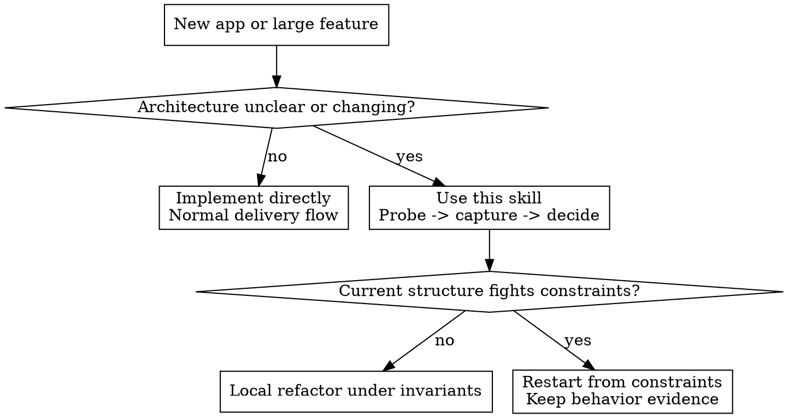

# Discovered Architecture

## Overview

Good architecture is usually discovered under constraint pressure, not guessed correctly on the first pass.

Use this skill to treat early implementation as a probe: build the thinnest real slice, capture concrete structural failures, promote only causal lessons into invariants, and decide explicitly whether the next move is local refactoring or a restart.

**Core principle:** Preserve behavioral evidence and causal constraints across iterations. Code is disposable; verified behavior and learned constraints are not.

## When to Use

- New application or large feature with unclear shape
- Early abstractions feel forced or speculative
- New requirements keep breaking boundaries or causing cross-cutting edits
- The team is considering a rewrite but lacks a decision rule
- An agent needs a repeatable architecture-discovery loop instead of generic “best practices”

Do not use this for routine bug fixes, small local features, or mature systems where the architecture is already stable and the task is mainly implementation.

## Quick Reference

| Stage | Ask | Keep | Output |
|------|-----|------|--------|
| Intent | What must be true? | goals, scenarios, constraints | `intent.md`, `scenarios.md` |
| Probe | What breaks first? | thin end-to-end slice | working probe |
| Friction review | What failed structurally? | concrete failures only | `failures.md` |
| Invariants | What lesson generalizes? | causal constraints only | `active-invariants.md` |
| Decision | Refactor or restart? | future cost, not sunk cost | `decision.md` |
| Convergence | Is the shape stabilizing? | scenario fit, local edits | continue or exit |

## Agent Flow

1. Define the smallest real workload before designing structure.
   Capture the feature goal, non-negotiables, and 3-7 representative scenarios. A scenario should be a real use case or likely change request, not a vague aspiration.

2. Build the cheapest probe that exercises the real difficulty.
   Prefer one thin end-to-end slice over broad scaffolding. Do not add extension points, layers, or patterns “just in case.”

3. Stop at the first structural friction point.
   Capture only concrete failures: boundaries that collapsed, edits that spread unexpectedly, concepts that had to be duplicated, or flows that became hard to explain.

4. Promote failures into invariants only when they generalize.
   Good invariant: “Read and write flows share the same consistency rules in this domain, so split models add ceremony without leverage.”
   Bad invariant: “CQRS felt heavy.”

5. Decide refactor versus restart explicitly.
   Refactor when the current structure is mostly aligned and the damage is local. Restart when preserving the current shape costs about as much as rebuilding from the accumulated constraints.

6. Repeat until the architecture stops changing in kind.
   You are converging when new scenarios fit known seams, changes stay local, and new iterations stop producing new structural invariants.

## Protocol And Artifacts

Load [references/protocol-and-artifacts.md](/Users/chad/Repos/awesome-skills/discovered-architecture/references/protocol-and-artifacts.md) when applying this skill. It defines:

- the iteration protocol
- the artifact bundle and directory layout
- invariant, failure, and decision formats
- the restart-versus-refactor rule
- convergence checks and stop conditions

## Example

Feature: bulk user import with preview, validation, and retry.

Weak first pass:
- separate “upload,” “validation,” and “apply” services immediately
- duplicate row-shaping rules across preview and apply
- add an event bus before failure modes are understood

Observed failure:
- every rule change touches preview, validator, and importer
- retries need the same normalized row model as preview

Promoted invariant:
- `INV-003`: preview, validation, and apply all depend on the same canonical row normalization; separate models create schema drift and three-way edits

That invariant does not tell you a pattern by name. It tells you what must be true in the next design.

## Common Mistakes

| Mistake | Correction |
|--------|------------|
| Treating “this feels messy” as a decision rule | Record concrete failure signals and compare future cost |
| Preserving code but not tests, fixtures, or scenarios | Keep behavior evidence across restarts |
| Promoting preferences into invariants | Only keep causal lessons tied to observed failure or leverage |
| Rewriting too late | Restart when preserving scaffolding costs about as much as rebuilding |
| Rewriting too early | Do not restart until a real probe has exposed structural friction |
| Using “no obvious wrongness” as the stop rule | Stop only when scenarios fit existing seams and new changes stay local |

## Bottom Line

Do not ask an agent to predict the final architecture up front.

Ask it to discover the architecture by repeatedly:
- exposing real structural friction
- compressing that friction into durable constraints
- preserving behavioral evidence
- rebuilding only when the existing shape is no longer the cheapest path to a stable design